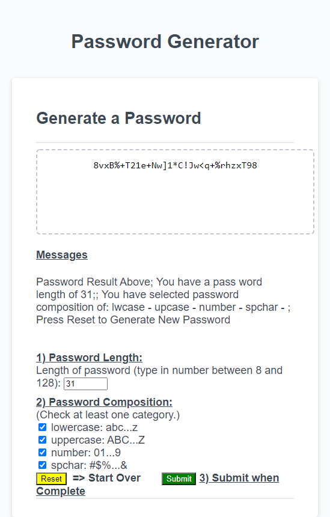

# Password-Generator
First Draft on Portfolio Page 

# Working Files
HTML,CSS,JS ... Files: https://github.com/gmcmurray/Password-Generator

Deployed Application: https://gmcmurray.github.io/Password-Generator/

## Description 

Create Password generator where user starts inputs
through clicking "Generate Password" Button.
A form is revealed through using DOM methods:
querySelector(), getElementById(), addEventListener(),
and setAttribute() to reveal form and hide "Generate Password"
button.

Password requirements are :
1) Password length between 8 and 128 characters.
2) Characters must be selected from subsets of lowercase,         uppercase,numerics and special characters. User selects composition of these groups where must select at least one subset and could select all four for a valid password.
3) Password is randomly generated and displayed in a text-area.
4) The page display should scale nicely with width.
  

All of the requirements and user engagement were programmed in java script.  In addition error checking was implemented to check for 
the requirementss.

## Screen Shot
Screen shot with width of 550 pixels : After "Generate Button" is clicked:

